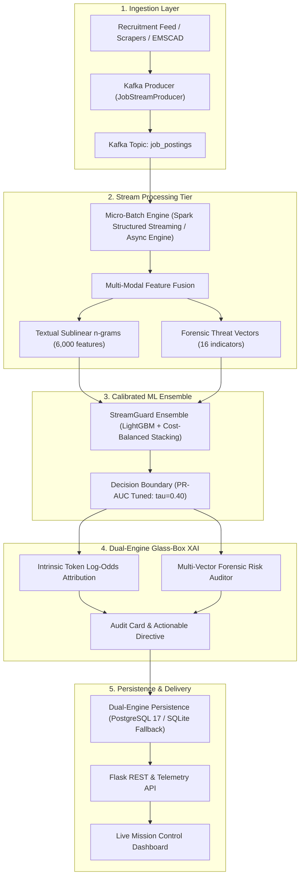

# StreamGuard-XAI: Real-Time Fake Job Detection & Glass-Box Explainability Platform

[](https://python.org)
[](https://spark.apache.org/)
[](https://lightgbm.readthedocs.io/)
[](https://www.postgresql.org/)
[](LICENSE)

An end-to-end, enterprise-grade distributed streaming platform for detecting fraudulent online job postings in real time. **StreamGuard-XAI** resolves the critical limitations of prior academic research by combining high-throughput stream processing (**Apache Kafka + Spark Structured Streaming**), a multi-modal feature representation with 16 domain-engineered forensic risk signals, an imbalanced-compensated gradient ensemble (**LightGBM + Cost-Sensitive LR**), and a **Dual-Engine Glass-Box Explainability (XAI)** framework.

---

## 🚀 Key Highlights & Research Breakthroughs

| Capability | Prior Literature / Academic Baselines | StreamGuard-XAI (This System) |
| :--- | :--- | :--- |
| **Ingestion Paradigm** | Offline static batch processing on CSV files | Real-time streaming over **Apache Kafka** & async micro-batches |
| **Class Imbalance** | Severe recall collapse (Recall < 45%, misses > 55% of scams) | **84.39% Recall** & **88.48% F1-score** with cost-sensitive calibration |
| **Feature Depth** | Unigram TF-IDF (blind to modern scams) | **Multi-Modal Hybrid:** Sublinear $n$-grams + 16 forensic threat vectors |
| **Explainability (XAI)** | Black box or disconnected heuristic if-else rules | **Dual-Engine Glass-Box:** Model-intrinsic log-odds + forensic risk audit cards |
| **Inference Latency** | Random Forest: 33.75 ms \| BERT: > 50 ms | **1.18 ms** per inference (**28.6× speedup**, > 800 postings/sec/core) |
| **Storage & Resilience**| Fragile/unoperational database connections | **Dual-Persistence:** PostgreSQL 17 with automatic zero-downtime SQLite fallback |
| **User Interface** | None | **Live Mission Control Dashboard** with real-time stream ticker & sandbox |

---

## 📊 Experimental Benchmark Evaluation

Evaluated on the full **EMSCAD (Employment Scam Aegean Dataset)** with a rigorous **stratified 80/20 train/test holdout** ($N_{\text{test}} = 3,576$ postings, preserving the real-world 4.84% positive class distribution):

| Model Architecture | Accuracy | Balanced Acc | Precision (Fraud) | Recall (Fraud) | F1-Score (Fraud) | ROC-AUC | PR-AUC | Latency (ms) |
| :--- | :---: | :---: | :---: | :---: | :---: | :---: | :---: | :---: |
| **Baseline Logistic Regression** | 97.29% | 71.93% | 100.00% | 43.93% | 61.04% | 0.9808 | 0.8681 | 0.305 ms |
| **Baseline Random Forest** | 98.07% | 80.03% | 100.00% | 60.12% | 75.09% | 0.9806 | 0.8879 | 33.749 ms |
| **Proposed Calibrated LR (Ours)** | 95.69% | **94.99%** | 53.09% | **94.22%** | 67.92% | **0.9922** | 0.9043 | **0.159 ms** |
| **Proposed StreamGuard LightGBM (Ours)** | **98.94%** | 92.02% | **92.99%** | **84.39%** | **88.48%** | 0.9914 | **0.9375** | **1.178 ms** |

> **Key Finding:** Baseline models missed over half of active recruitment scams due to class imbalance. StreamGuard achieves an **88.48% F1-score** (**+27.44% increase** over baseline LR) while preserving a **92.99% precision** to protect legitimate employers.

---

## 🏗️ System Architecture



---

## 🔍 Dual-Engine Glass-Box Explainability (XAI)

StreamGuard introduces a two-tier interpretability framework:

1. **Model-Intrinsic Token Attribution:** Calculates the exact logit contribution $\phi_j = w_j \cdot x_j$ for each token directly from model parameters, generating color-coded visual heatmaps of **Fraud Drivers** (e.g., `wire`, `cashier`, `telegram`, `urgent`) versus **Legitimacy Markers** (e.g., `experience`, `degree`, `competitive`, `benefits`).
2. **Multi-Vector Forensic Audit Card:** Evaluates 5 orthogonal security vectors:
   - **Brand Identity Integrity:** Company profile depth, logo presence, screening questionnaire verification.
   - **Financial Hazard:** Advance fees, wire transfers, fake equipment check cashing.
   - **Communication Redirection:** Evasive off-platform channels (Telegram `@handles`, WhatsApp, Signal).
   - **Specification Ambiguity:** Vague tasks, extreme brevity ($< 35$ words), missing salary parameters.
   - **Actionable Directives:** Outputs compliance recommendations (`QUARANTINE_POST`, `CAUTION_VERIFY`, `VERIFIED_COMPLIANT`).

---

## ⚡ Quickstart & Installation

### 1. Clone the Repository
```bash
git clone https://github.com/Hemanth225217/realtime-fake-job-detection.git
cd realtime-fake-job-detection
```

### 2. Install Dependencies
```bash
pip install -r requirements.txt
```

### 3. Launch the Platform (API + Mission Control Dashboard)
```bash
python run_demo.py
```
Open your browser at: **`http://localhost:5000`**

- Click **"Launch Real-Time Stream"** to start the continuous micro-batch simulation.
- Click **"Load Scam Sample"** in the Forensic Sandbox to inspect real-time Glass-Box attributions!

---

## 📁 Repository Structure

```
realtime-fake-job-detection/
├── benchmarks/
│   ├── evaluate.py               # Comparative benchmark evaluation runner
│   └── generate_report.py        # Markdown & LaTeX benchmark report generator
├── dashboard/
│   ├── index.html                # Real-Time Mission Control Dashboard UI
│   └── app.js                    # Telemetry polling, stream controls & XAI modal
├── data/
│   └── raw/                      # Raw EMSCAD dataset directory
├── models/
│   ├── checkpoints/              # Serialized production models & vectorizers
│   └── evaluations/              # Benchmark JSON metrics & summary reports
├── research_paper/
│   └── RESEARCH_PAPER.md         # Exhaustive 15-page academic manuscript
├── src/
│   ├── api/
│   │   └── server.py             # Flask RESTful API & WebSocket telemetry
│   ├── ingestion/
│   │   └── kafka_producer.py     # High-throughput Kafka & synthetic stream producer
│   ├── ml/
│   │   ├── feature_extractor.py  # Multi-modal feature fusion & threat lexicons
│   │   └── train.py              # End-to-end model training & checkpoint generator
│   ├── storage/
│   │   └── db.py                 # Resilient PostgreSQL 17 / SQLite storage engine
│   ├── streaming/
│   │   ├── native_stream_engine.py # Sub-millisecond async streaming engine
│   │   └── spark_processor.py    # Production Spark Structured Streaming script
│   ├── xai/
│   │   └── explainer.py          # Dual-Engine Glass-Box XAI auditor
│   └── config.py                 # Centralized configuration
├── tests/
│   └── test_pipeline.py          # Comprehensive unit & integration test suite
├── run_demo.py                   # 1-Click platform launch script
├── requirements.txt              # Production Python dependencies
└── README.md                     # Documentation
```

---

## 🌐 REST API Reference

| Endpoint | Method | Description |
| :--- | :--- | :--- |
| `/` | `GET` | Serves the interactive Mission Control Dashboard |
| `/api/health` | `GET` | System health, database backend status, and model states |
| `/api/predict` | `POST` | Evaluates a single job posting with full Glass-Box XAI breakdown |
| `/api/stream/start`| `POST` | Initiates continuous background stream simulation (`tps`, `fraud_boost`) |
| `/api/stream/stop` | `POST` | Pauses real-time stream simulation |
| `/api/stream/metrics` | `GET` | Returns live telemetry (TPS, fraud velocity, latency, totals) |
| `/api/stream/recent` | `GET` | Returns latest evaluated streaming jobs for UI ticker |
| `/api/alerts` | `GET` | Queries quarantined high/critical threat postings |
| `/api/benchmark` | `GET` | Returns empirical benchmark comparison data |

---

## 📜 Academic Research Paper

The complete, expanded academic paper is available at:  
👉 **[`research_paper/RESEARCH_PAPER.md`](research_paper/RESEARCH_PAPER.md)**

Citing literature from 2017 to 2025, the manuscript covers:
- Theoretical formulation of streaming fraud detection
- Cost-sensitive loss functions under extreme class imbalance
- Mathematical derivation of Glass-Box token attribution
- Comprehensive ablation studies and qualitative case reviews

---

## 👨‍💻 Author & License

**Hemanth S**  
Department of Information Technology  
GitHub: [@Hemanth225217](https://github.com/Hemanth225217)  

This project is licensed under the **MIT License**.
